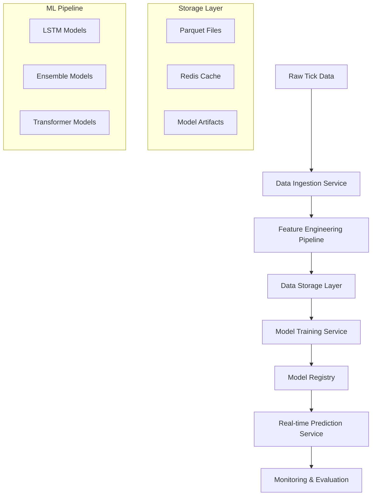

# Design Document

## Overview

선물옵션 틱데이터 분석 시스템은 대용량 시계열 데이터 처리, 도메인 특화 특징 엔지니어링, 다중 머신러닝 모델 학습, 그리고 실시간 예측을 지원하는 종합적인 플랫폼입니다. 시스템은 마이크로서비스 아키텍처를 기반으로 하며, 각 컴포넌트는 독립적으로 확장 가능하도록 설계됩니다.

## Architecture

### High-Level Architecture



### System Components

1. **Data Ingestion Service**: 원시 틱데이터 수집 및 전처리
2. **Feature Engineering Pipeline**: 도메인 특화 특징 생성
3. **Data Storage Layer**: 효율적인 데이터 저장 및 조회
4. **Model Training Service**: 다중 모델 학습 및 최적화
5. **Model Registry**: 학습된 모델 버전 관리
6. **Real-time Prediction Service**: 실시간 예측 및 추론
7. **Monitoring & Evaluation**: 성능 모니터링 및 백테스팅

## Components and Interfaces

### 1. Data Ingestion Service

**Purpose**: 원시 틱데이터를 파싱하고 표준화된 형태로 변환

**Key Classes**:
```python
class TickDataParser:
    def parse_order_book(self, raw_data: bytes) -> OrderBookSnapshot
    def parse_trade_data(self, raw_data: bytes) -> TradeRecord
    def validate_data_integrity(self, data: Dict) -> bool

class DataIngestionPipeline:
    def process_batch(self, file_paths: List[str]) -> None
    def handle_streaming_data(self, stream: Iterator) -> None
```

**Interfaces**:
- Input: 원시 틱데이터 파일 (CSV, Binary formats)
- Output: 표준화된 JSON/Parquet 형태의 구조화된 데이터

### 2. Feature Engineering Pipeline

**Purpose**: 호가창 및 체결 데이터로부터 예측에 유용한 특징 생성

**Key Classes**:
```python
class OrderBookFeatureExtractor:
    def calculate_order_imbalance(self, bid_volume: float, ask_volume: float) -> float
    def calculate_pressure_ratio(self, bid_levels: List, ask_levels: List) -> float
    def calculate_spread_features(self, order_book: OrderBookSnapshot) -> Dict

class TimeSeriesFeatureGenerator:
    def create_rolling_features(self, data: pd.DataFrame, windows: List[int]) -> pd.DataFrame
    def calculate_vwap(self, prices: List[float], volumes: List[float]) -> float
    def generate_technical_indicators(self, price_series: pd.Series) -> Dict

class FeaturePipeline:
    def transform(self, raw_data: pd.DataFrame) -> pd.DataFrame
    def create_sliding_windows(self, data: pd.DataFrame, window_size: int) -> np.ndarray
```

**Interfaces**:
- Input: 구조화된 틱데이터
- Output: 특징 벡터 (NumPy arrays, Pandas DataFrames)

### 3. Data Storage Layer

**Purpose**: 대용량 시계열 데이터의 효율적 저장 및 빠른 조회

**Key Classes**:
```python
class ParquetDataStore:
    def save_daily_data(self, date: str, data: pd.DataFrame) -> None
    def load_date_range(self, start_date: str, end_date: str) -> pd.DataFrame
    def create_partitions(self, data: pd.DataFrame) -> None

class RedisFeatureCache:
    def cache_features(self, key: str, features: np.ndarray, ttl: int) -> None
    def get_cached_features(self, key: str) -> Optional[np.ndarray]
    def manage_sliding_window(self, key: str, new_data: np.ndarray, max_size: int) -> None

class ModelArtifactStore:
    def save_model(self, model: Any, version: str, metadata: Dict) -> str
    def load_model(self, model_id: str) -> Any
    def list_model_versions(self, model_name: str) -> List[Dict]
```

### 4. Model Training Service

**Purpose**: 다양한 머신러닝 모델의 학습 및 하이퍼파라미터 최적화

**Key Classes**:
```python
class LSTMModel:
    def __init__(self, sequence_length: int, n_features: int)
    def build_model(self) -> tf.keras.Model
    def train(self, X_train: np.ndarray, y_train: np.ndarray) -> Dict

class EnsembleModel:
    def __init__(self, base_models: List[str])
    def create_stacking_ensemble(self) -> StackingClassifier
    def train_ensemble(self, X_train: np.ndarray, y_train: np.ndarray) -> None

class TransformerModel:
    def __init__(self, d_model: int, n_heads: int, num_layers: int)
    def build_attention_model(self) -> tf.keras.Model
    def apply_positional_encoding(self, inputs: tf.Tensor) -> tf.Tensor

class ModelTrainer:
    def train_model(self, model_type: str, config: Dict) -> TrainingResult
    def hyperparameter_optimization(self, model_type: str, search_space: Dict) -> Dict
    def cross_validate(self, model: Any, X: np.ndarray, y: np.ndarray) -> Dict
```

### 5. Real-time Prediction Service

**Purpose**: 실시간 데이터 스트림에 대한 즉시 예측 수행

**Key Classes**:
```python
class RealTimePredictor:
    def __init__(self, model_registry: ModelRegistry)
    def update_feature_buffer(self, new_tick: Dict) -> None
    def predict(self) -> Optional[Dict]
    def manage_model_ensemble(self, predictions: List[Dict]) -> Dict

class StreamProcessor:
    def process_tick_stream(self, stream: Iterator[Dict]) -> Iterator[Dict]
    def apply_feature_engineering(self, tick_data: Dict) -> np.ndarray
    def handle_prediction_latency(self, max_latency_ms: int) -> None
```

## Data Models

### Core Data Structures

```python
@dataclass
class OrderBookSnapshot:
    timestamp: datetime
    symbol: str
    bid_levels: List[PriceLevel]
    ask_levels: List[PriceLevel]
    
@dataclass
class PriceLevel:
    price: float
    volume: float
    open_interest: float
    order_count: int

@dataclass
class TradeRecord:
    timestamp: datetime
    symbol: str
    price: float
    volume: float
    side: str  # 'buy' or 'sell'
    
@dataclass
class FeatureVector:
    timestamp: datetime
    symbol: str
    features: np.ndarray
    feature_names: List[str]
    
@dataclass
class PredictionResult:
    timestamp: datetime
    symbol: str
    prediction: float  # probability of price increase
    confidence: float
    model_version: str
```

### Database Schema

**Parquet File Structure**:
```
/data/
├── tick_data/
│   ├── year=2024/
│   │   ├── month=01/
│   │   │   ├── day=01/
│   │   │   │   └── symbol=ES/
│   │   │   │       └── data.parquet
├── features/
│   ├── year=2024/
│   │   ├── month=01/
│   │   │   └── features.parquet
└── predictions/
    ├── year=2024/
    │   ├── month=01/
    │   │   └── predictions.parquet
```

## Error Handling

### Exception Hierarchy

```python
class TickAnalysisException(Exception):
    """Base exception for tick analysis system"""
    pass

class DataIngestionError(TickAnalysisException):
    """Raised when data ingestion fails"""
    pass

class FeatureEngineeringError(TickAnalysisException):
    """Raised when feature engineering fails"""
    pass

class ModelTrainingError(TickAnalysisException):
    """Raised when model training fails"""
    pass

class PredictionError(TickAnalysisException):
    """Raised when prediction fails"""
    pass
```

### Error Handling Strategies

1. **Data Quality Issues**:
   - Implement data validation at ingestion
   - Use circuit breaker pattern for external data sources
   - Graceful degradation when features are missing

2. **Model Training Failures**:
   - Automatic retry with exponential backoff
   - Fallback to simpler models when complex models fail
   - Comprehensive logging for debugging

3. **Real-time Processing Errors**:
   - Buffer management with overflow handling
   - Timeout mechanisms for prediction requests
   - Health checks and automatic recovery

4. **Storage Failures**:
   - Redundant storage with automatic failover
   - Data integrity checks and repair mechanisms
   - Backup and recovery procedures

## Testing Strategy

### Unit Testing

```python
class TestOrderBookFeatureExtractor(unittest.TestCase):
    def test_order_imbalance_calculation(self):
        # Test order imbalance calculation with known values
        
    def test_pressure_ratio_calculation(self):
        # Test pressure ratio with various bid/ask scenarios
        
    def test_edge_cases(self):
        # Test with zero volumes, missing data, etc.
```

### Integration Testing

```python
class TestFeaturePipeline(unittest.TestCase):
    def test_end_to_end_feature_generation(self):
        # Test complete pipeline from raw data to features
        
    def test_data_consistency(self):
        # Ensure features are consistent across different runs
```

### Performance Testing

```python
class TestPerformance(unittest.TestCase):
    def test_ingestion_throughput(self):
        # Test data ingestion rate with large datasets
        
    def test_prediction_latency(self):
        # Test real-time prediction response time
        
    def test_memory_usage(self):
        # Monitor memory consumption during processing
```

### Backtesting Framework

```python
class BacktestEngine:
    def __init__(self, start_date: str, end_date: str):
        self.start_date = start_date
        self.end_date = end_date
        
    def run_walk_forward_analysis(self, model: Any, window_size: int) -> Dict:
        # Implement walk-forward validation
        
    def calculate_performance_metrics(self, predictions: List, actuals: List) -> Dict:
        # Calculate Sharpe ratio, max drawdown, etc.
        
    def generate_pnl_curve(self, trades: List[Dict]) -> pd.Series:
        # Generate profit/loss curve for visualization
```

### Model Validation

```python
class ModelValidator:
    def validate_model_performance(self, model: Any, test_data: Tuple) -> Dict:
        # Comprehensive model performance evaluation
        
    def check_overfitting(self, train_scores: List, val_scores: List) -> bool:
        # Detect overfitting patterns
        
    def stability_test(self, model: Any, perturbed_data: np.ndarray) -> Dict:
        # Test model stability with noisy inputs
```

이 설계는 확장 가능하고 유지보수가 용이한 시스템을 제공하며, 대용량 데이터 처리와 실시간 예측 요구사항을 모두 만족합니다.