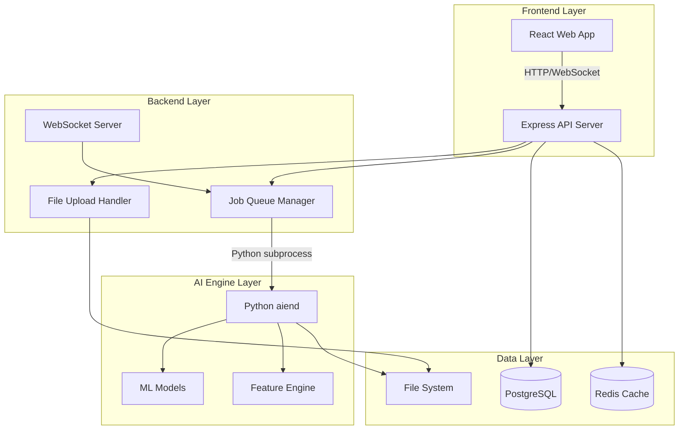

# Design Document

## Overview

틱데이터 통합 플랫폼은 기존의 aiend AI 분석 엔진을 중심으로 한 3-tier 아키텍처로 설계됩니다. 사용자는 React 기반 웹 프론트엔드를 통해 틱데이터를 업로드하고, Node.js 백엔드가 이를 처리하여 Python aiend 엔진과 연동합니다. 전체 시스템은 확장 가능하고 유지보수가 용이한 마이크로서비스 지향 아키텍처를 따릅니다.

## Architecture

### System Architecture Diagram



### Technology Stack

- **Frontend**: React 18 + TypeScript + Tailwind CSS + Vite
- **Backend**: Node.js + Express + TypeScript + Socket.io
- **Database**: PostgreSQL (메타데이터) + Redis (캐싱/세션)
- **AI Engine**: Python aiend (기존 구조 유지)
- **File Storage**: Local File System (향후 S3 확장 가능)
- **Communication**: REST API + WebSocket + Python subprocess

## Components and Interfaces

### Frontend Components

#### 1. File Upload Component
```typescript
interface FileUploadProps {
  onUploadComplete: (fileInfo: UploadedFile) => void;
  acceptedFormats: string[];
  maxFileSize: number;
}

interface UploadedFile {
  id: string;
  filename: string;
  size: number;
  uploadedAt: Date;
  status: 'uploading' | 'completed' | 'error';
}
```

#### 2. Analysis Dashboard Component
```typescript
interface AnalysisDashboardProps {
  analyses: Analysis[];
  onStartAnalysis: (config: AnalysisConfig) => void;
  onViewResults: (analysisId: string) => void;
}

interface Analysis {
  id: string;
  datasetId: string;
  modelType: ModelType;
  status: 'pending' | 'running' | 'completed' | 'failed';
  progress: number;
  startedAt: Date;
  completedAt?: Date;
  results?: AnalysisResults;
}
```

#### 3. Results Visualization Component
```typescript
interface ResultsVisualizationProps {
  results: AnalysisResults;
  chartType: 'line' | 'candlestick' | 'heatmap';
}

interface AnalysisResults {
  accuracy: number;
  sharpeRatio: number;
  maxDrawdown: number;
  profitLoss: number[];
  predictions: Prediction[];
  metrics: PerformanceMetrics;
}
```

### Backend API Interfaces

#### 1. File Management API
```typescript
// POST /api/files/upload
interface FileUploadRequest {
  file: Express.Multer.File;
  metadata?: {
    description?: string;
    tags?: string[];
  };
}

interface FileUploadResponse {
  fileId: string;
  filename: string;
  path: string;
  size: number;
  checksum: string;
}

// GET /api/files
interface FileListResponse {
  files: FileMetadata[];
  pagination: PaginationInfo;
}
```

#### 2. Analysis Management API
```typescript
// POST /api/analysis/start
interface StartAnalysisRequest {
  datasetId: string;
  modelType: 'lstm' | 'transformer' | 'ensemble' | 'cnn_lstm';
  config: ModelConfig;
}

interface ModelConfig {
  lstm?: {
    sequence_length: number;
    lstm_units: number[];
    dropout_rate: number;
    epochs: number;
    batch_size: number;
  };
  transformer?: {
    d_model: number;
    n_heads: number;
    num_layers: number;
    epochs: number;
  };
  // ... other model configs
}

// GET /api/analysis/:id/status
interface AnalysisStatusResponse {
  id: string;
  status: AnalysisStatus;
  progress: number;
  currentStep: string;
  estimatedTimeRemaining?: number;
  logs: LogEntry[];
}
```

#### 3. Results API
```typescript
// GET /api/analysis/:id/results
interface AnalysisResultsResponse {
  analysisId: string;
  results: {
    performance: PerformanceMetrics;
    predictions: PredictionData[];
    charts: ChartData[];
    downloadUrls: {
      csv: string;
      json: string;
      report: string;
    };
  };
}
```

### AI Engine Integration Interface

#### 1. Python Subprocess Communication
```typescript
interface AIEngineManager {
  startAnalysis(config: AnalysisJobConfig): Promise<JobHandle>;
  getJobStatus(jobId: string): Promise<JobStatus>;
  cancelJob(jobId: string): Promise<void>;
  getResults(jobId: string): Promise<AnalysisResults>;
}

interface AnalysisJobConfig {
  dataPath: string;
  modelType: string;
  hyperparameters: Record<string, any>;
  outputPath: string;
  configPath: string;
}
```

#### 2. aiend Integration Layer
```python
# aiend/src/api/web_interface.py
class WebInterfaceAPI:
    def start_analysis(self, config: Dict[str, Any]) -> str:
        """웹에서 시작된 분석 작업을 처리"""
        
    def get_analysis_status(self, job_id: str) -> Dict[str, Any]:
        """분석 작업 상태 조회"""
        
    def get_analysis_results(self, job_id: str) -> Dict[str, Any]:
        """분석 결과 조회"""
```

## Data Models

### Database Schema

#### 1. Files Table
```sql
CREATE TABLE files (
    id UUID PRIMARY KEY DEFAULT gen_random_uuid(),
    filename VARCHAR(255) NOT NULL,
    original_name VARCHAR(255) NOT NULL,
    file_path TEXT NOT NULL,
    file_size BIGINT NOT NULL,
    mime_type VARCHAR(100),
    checksum VARCHAR(64),
    metadata JSONB,
    uploaded_at TIMESTAMP DEFAULT NOW(),
    created_by UUID REFERENCES users(id)
);
```

#### 2. Analyses Table
```sql
CREATE TABLE analyses (
    id UUID PRIMARY KEY DEFAULT gen_random_uuid(),
    dataset_id UUID REFERENCES files(id),
    model_type VARCHAR(50) NOT NULL,
    config JSONB NOT NULL,
    status analysis_status DEFAULT 'pending',
    progress INTEGER DEFAULT 0,
    started_at TIMESTAMP,
    completed_at TIMESTAMP,
    error_message TEXT,
    results_path TEXT,
    created_by UUID REFERENCES users(id),
    created_at TIMESTAMP DEFAULT NOW()
);

CREATE TYPE analysis_status AS ENUM (
    'pending', 'running', 'completed', 'failed', 'cancelled'
);
```

#### 3. Analysis Results Table
```sql
CREATE TABLE analysis_results (
    id UUID PRIMARY KEY DEFAULT gen_random_uuid(),
    analysis_id UUID REFERENCES analyses(id),
    metrics JSONB NOT NULL,
    predictions_path TEXT,
    charts_data JSONB,
    created_at TIMESTAMP DEFAULT NOW()
);
```

### Redis Data Structures

#### 1. Job Queue
```typescript
// Job Queue Structure
interface JobQueueItem {
  jobId: string;
  analysisId: string;
  priority: number;
  createdAt: Date;
  config: AnalysisJobConfig;
}

// Redis Keys:
// jobs:pending - List of pending jobs
// jobs:running - Hash of currently running jobs
// job:{jobId}:status - Job status and progress
// job:{jobId}:logs - Job execution logs
```

#### 2. Session Cache
```typescript
// User Session Cache
interface UserSession {
  userId: string;
  uploadedFiles: string[];
  runningAnalyses: string[];
  preferences: UserPreferences;
}

// Redis Keys:
// session:{sessionId} - User session data
// user:{userId}:active_jobs - User's active analysis jobs
```

## Error Handling

### Frontend Error Handling
```typescript
interface ErrorBoundary {
  handleFileUploadError(error: UploadError): void;
  handleAnalysisError(error: AnalysisError): void;
  handleNetworkError(error: NetworkError): void;
}

enum ErrorType {
  FILE_TOO_LARGE = 'FILE_TOO_LARGE',
  INVALID_FORMAT = 'INVALID_FORMAT',
  ANALYSIS_FAILED = 'ANALYSIS_FAILED',
  NETWORK_ERROR = 'NETWORK_ERROR',
  UNAUTHORIZED = 'UNAUTHORIZED'
}
```

### Backend Error Handling
```typescript
class ErrorHandler {
  static handleFileUploadError(error: Error): ApiResponse {
    // File upload specific error handling
  }
  
  static handleAIEngineError(error: Error): ApiResponse {
    // AI engine communication error handling
  }
  
  static handleDatabaseError(error: Error): ApiResponse {
    // Database operation error handling
  }
}

interface ApiResponse {
  success: boolean;
  data?: any;
  error?: {
    code: string;
    message: string;
    details?: any;
  };
}
```

### AI Engine Error Handling
```python
# aiend/src/exceptions.py에 추가
class WebInterfaceError(TickAnalysisException):
    """웹 인터페이스 연동 중 발생하는 예외"""

class JobExecutionError(WebInterfaceError):
    """작업 실행 중 발생하는 예외"""
```

## Testing Strategy

### Frontend Testing
```typescript
// Component Testing with React Testing Library
describe('FileUpload Component', () => {
  test('should upload file successfully', async () => {
    // Test file upload functionality
  });
  
  test('should handle upload errors', async () => {
    // Test error handling
  });
});

// Integration Testing with MSW (Mock Service Worker)
describe('Analysis Dashboard Integration', () => {
  test('should start analysis and show progress', async () => {
    // Test full analysis workflow
  });
});
```

### Backend Testing
```typescript
// API Testing with Jest and Supertest
describe('File Upload API', () => {
  test('POST /api/files/upload should upload file', async () => {
    const response = await request(app)
      .post('/api/files/upload')
      .attach('file', 'test-data.csv')
      .expect(200);
  });
});

// Integration Testing with Test Database
describe('Analysis Workflow', () => {
  test('should complete full analysis workflow', async () => {
    // Test end-to-end analysis process
  });
});
```

### AI Engine Testing
```python
# aiend/tests/test_web_interface.py
class TestWebInterface:
    def test_start_analysis_from_web(self):
        """웹에서 시작된 분석 작업 테스트"""
        
    def test_job_status_tracking(self):
        """작업 상태 추적 테스트"""
        
    def test_results_serialization(self):
        """결과 직렬화 테스트"""
```

## Performance Considerations

### File Upload Optimization
- **Chunked Upload**: 대용량 파일을 청크 단위로 업로드
- **Progress Tracking**: 실시간 업로드 진행률 표시
- **Compression**: 파일 압축을 통한 전송 최적화
- **Validation**: 클라이언트 사이드 파일 검증

### Analysis Performance
- **Job Queue**: Redis 기반 작업 큐로 동시 실행 관리
- **Resource Monitoring**: CPU/메모리 사용량 모니터링
- **Caching**: 분석 결과 캐싱으로 재조회 성능 향상
- **Streaming**: 대용량 결과 데이터 스트리밍 전송

### Database Optimization
- **Indexing**: 자주 조회되는 컬럼에 인덱스 생성
- **Connection Pooling**: 데이터베이스 연결 풀 관리
- **Query Optimization**: N+1 쿼리 문제 방지
- **Pagination**: 대용량 데이터 페이지네이션

## Security Considerations

### Authentication & Authorization
```typescript
interface AuthMiddleware {
  authenticateUser(req: Request): Promise<User>;
  authorizeFileAccess(user: User, fileId: string): Promise<boolean>;
  authorizeAnalysisAccess(user: User, analysisId: string): Promise<boolean>;
}
```

### File Security
- **File Type Validation**: 허용된 파일 형식만 업로드
- **Virus Scanning**: 업로드된 파일 바이러스 검사
- **Path Traversal Prevention**: 경로 조작 공격 방지
- **File Size Limits**: 파일 크기 제한

### Data Protection
- **Encryption**: 민감한 데이터 암호화 저장
- **Access Logging**: 파일 및 분석 접근 로그
- **Data Retention**: 데이터 보관 정책 및 자동 삭제
- **Backup**: 정기적인 데이터 백업

## Deployment Architecture

### Development Environment
```yaml
# docker-compose.dev.yml
version: '3.8'
services:
  frontend:
    build: ./frontend
    ports: ["3000:3000"]
    volumes: ["./frontend:/app"]
    
  backend:
    build: ./backend
    ports: ["8000:8000"]
    volumes: ["./backend:/app"]
    depends_on: [postgres, redis]
    
  postgres:
    image: postgres:15
    environment:
      POSTGRES_DB: ticktrader
      
  redis:
    image: redis:7-alpine
```

### Production Considerations
- **Load Balancing**: Nginx를 통한 로드 밸런싱
- **SSL/TLS**: HTTPS 통신 보안
- **Monitoring**: Prometheus + Grafana 모니터링
- **Logging**: ELK Stack을 통한 중앙화된 로깅
- **Backup**: 자동화된 데이터베이스 백업
- **Scaling**: 수평적 확장 가능한 아키텍처